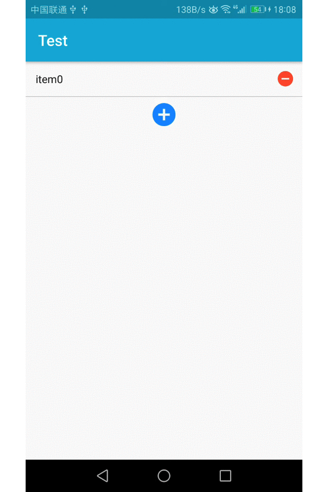

### AddListView
#####一个动态添加，删除item的自定义控件
<a href="./screenshots/AddListView.gif">  </a>
####使用方法
- 在project 的build.gradle文件下添加：
```
allprojects {
    repositories {
        maven { url 'https://jitpack.io' }
    }
}
```
- 然后添加依赖
```
dependencies {
     compile 'com.github.456chenxigang:AddListView:1.0.0'

 }
```
### AddListView 一个动态添加，删除item的自定义控件
<a href="./screenshots/AddListView.gif">  </a>
